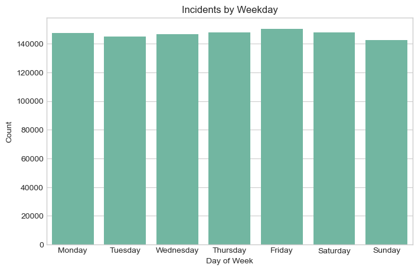
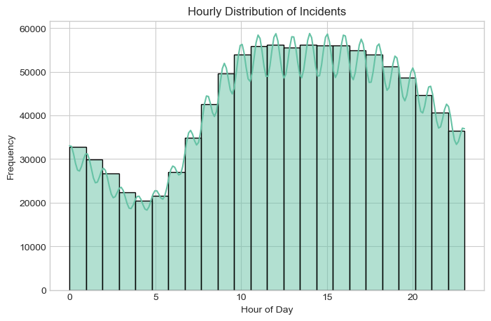
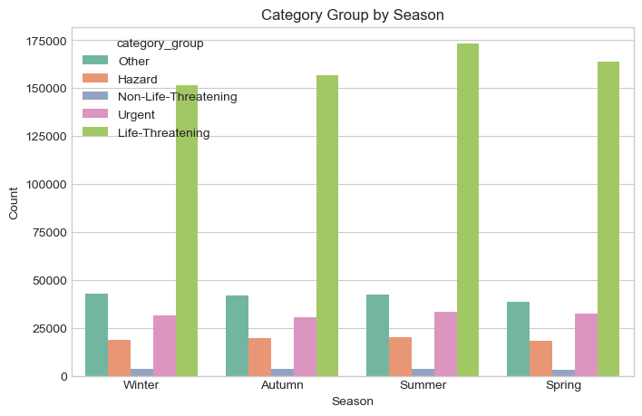
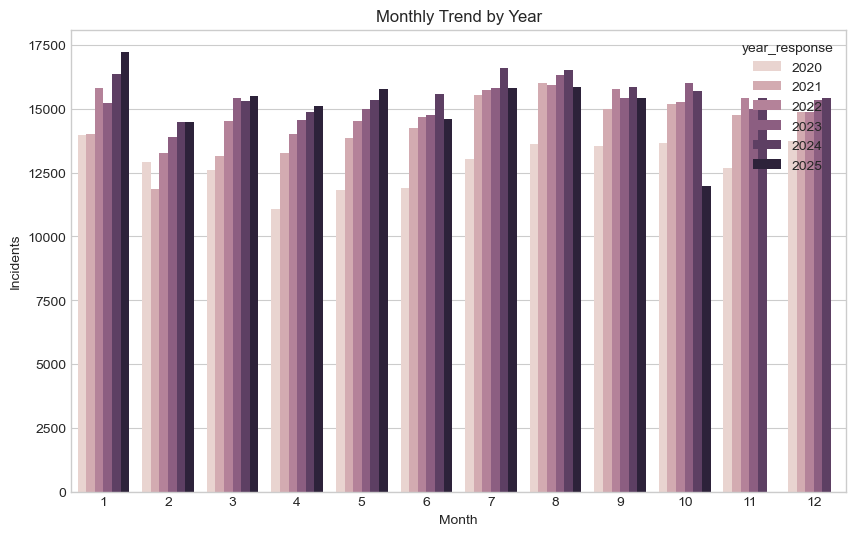
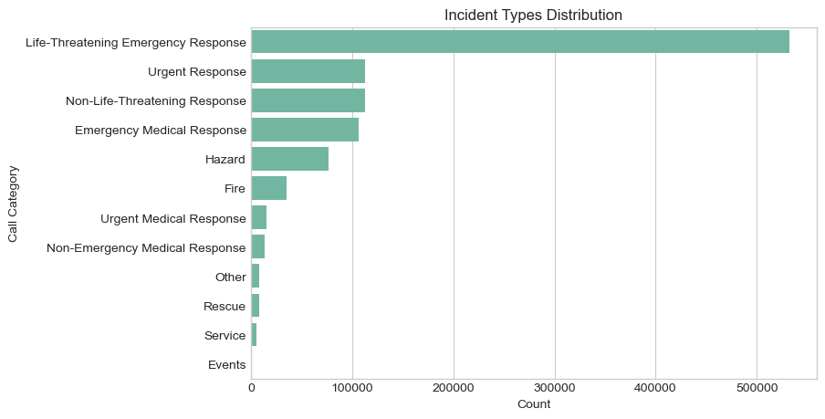
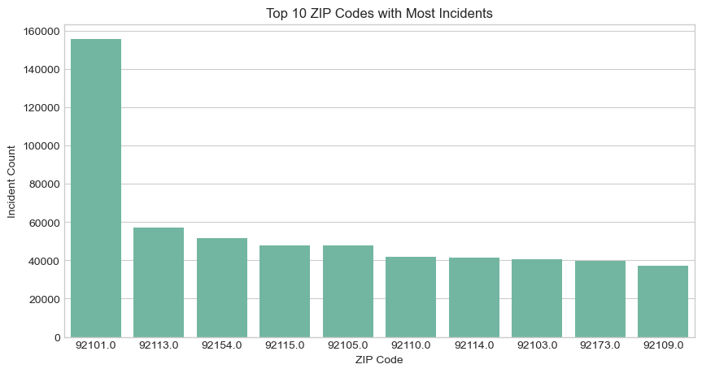
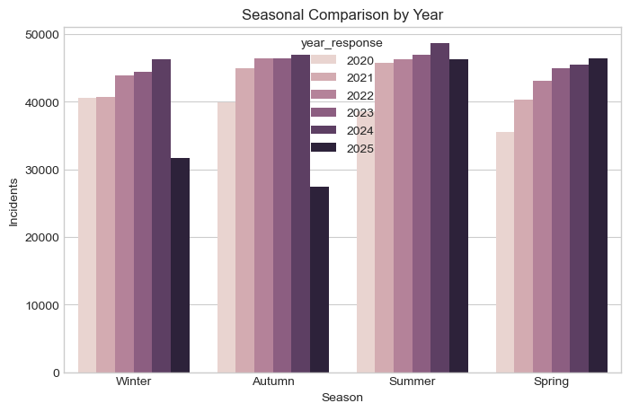
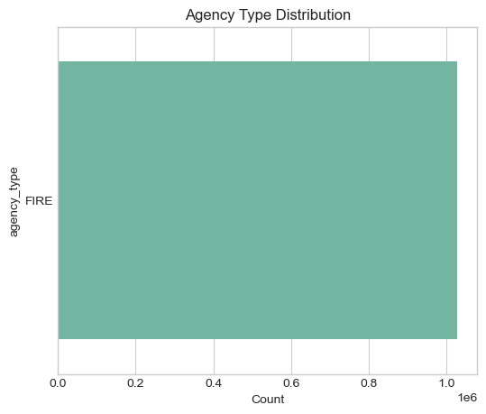
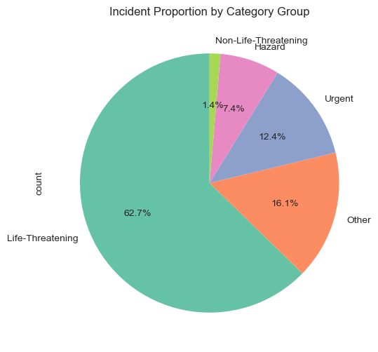

# 🚒 San Diego Fire Department Incidents Analysis (2020–2025)

[](https://www.linkedin.com/in/mohamed-emad-396981344/) 
[](mailto:mohamedemad24649.com)

### 🔍 Overview
This project analyzes **Fire & Emergency incidents in San Diego (CA)** between **2020 and 2025**,  
using Python for data cleaning, visualization, and trend discovery.  
It aims to reveal key insights about response types, temporal patterns, and affected areas.  

**Built using:** `Pandas`, `Matplotlib`, `Seaborn`, and `Power BI`  
**Dataset Source:** Official San Diego Open Data Portal  

---

## 🧠 Objectives
- Explore long-term patterns of fire & emergency incidents.  
- Identify the most frequent categories and life-threatening emergencies.  
- Analyze seasonal and hourly peaks to support decision-making.  
- Provide a clean visualization foundation for Power BI dashboarding.  

---

## 📂 Project Structure
```
📦 Fire_Incidents_Analysis/
┣ 📁 data/
┃ ┗ fd_incidents_clean.csv # (https://data.sandiego.gov/datasets/fire-incidents)
┣ 📄 queries.sql
┣ 📄 analysis_script.py
┣ 📁 charts/
┃ ┣ incidents_by_weekday.png
┃ ┣ incidents_by_month.png
┃ ┣ hourly_distribution.png
┃ ┣ incident_types_distribution.png
┃ ┣ category_by_season.png
┃ ┣ category_by_year.png
┃ ┣ top_zip_codes.png
┃ ┣ monthly_trend_by_year.png
┃ ┣ seasonal_comparison_by_year.png
┃ ┣ agency_type_distribution.png
┃ ┗ pie_category_group.png
┣ 📄 dashboard.pbix
┗ 📄 README.md
```

---

## 📊 Key Statistics

| Metric | Value |
|:--|--:|
| **Total Incidents (2020–2025)** | ≈ 1,000,000 |
| **Life-Threatening** | ~520,000 |
| **Urgent Response** | ~90,000 |
| **Hazard** | ~60,000 |
| **Peak ZIP Code** | 92101 (≈159,000 incidents) |
| **Peak Season** | Winter (≈150,000 Life-Threatening) |
| **Busiest Hour** | 13:00 (≈60,000 incidents) |
| **Lowest Hour** | 4:00 (≈38,000 incidents) |

---

## 📈 Main Visualizations (Python)

### 1️. Incidents by Weekday
  
**Top Day:** Friday (152,000)  
**Lowest:** Sunday (145,000)

---

### 2️. Hourly Distribution
  
Incidents peak between **12 PM – 2 PM** and decrease after midnight.

---

### 3️. Category Group by Season
  
Winter shows the highest number of life-threatening cases across all categories.

---

### 4️. Monthly Trend by Year
  
Consistent increase from 2020 → 2024, slight drop in 2025.

---

### 5️. Incident Types Distribution
  
Life-Threatening emergencies dominate (≈63%) followed by Urgent (12%).

---

### 6️. Top ZIP Codes
  
ZIP **92101** is the most affected area, with nearly 160K incidents.

---

### 7️. Seasonal Comparison by Year
  
Seasonal variations show strong summer peaks and lower winter activity.

---

### 8️. Agency Type Distribution
  
All incidents are handled under the **FIRE** agency type.

---

### 9️. Category Group Proportion
  
Pie chart shows the relative proportions of each incident group.

---

##  Dashboard Overview (Power BI)
The Power BI dashboard complements the Python analysis and includes:  
- **Overview Page:** KPIs, Yearly & Monthly Trends.  
- **Time Analysis:** Weekday & Hour Insights.  
- **Category Analysis:** Call Categories & Problem Patterns.  
- **Insights Page:** Top ZIPs, Hour Peaks, Seasonal Highlights.  

---

## 🧠 Insights Summary

### 🔹 Key Findings

1. **Life-Threatening Dominance**  
   - Over **62%** of all recorded incidents are life-threatening emergencies.  
   - This high proportion indicates a consistent pressure on advanced response units and hospital emergency capacity.  

2. **Temporal Patterns (Time & Hour Analysis)**  
   - **Peak activity hours:** between **12:00 PM and 2:00 PM** daily.  
   - **Lowest incident hours:** between **3:00 AM and 5:00 AM**, suggesting quieter overnight shifts.  
   - **Weekday trends:** Slightly higher activity on **Fridays and Thursdays**, possibly due to increased human mobility and events.  

3. **Seasonal & Yearly Trends**  
   - **Summer** recorded the highest overall incidents, followed by **Spring**.  
   - From **2020 → 2024**, a steady rise was observed in incident counts (~+13%), but **2025** shows a **notable drop (~15%)**, suggesting potential operational changes or incomplete data coverage.  

4. **Geographical Distribution (ZIP Analysis)**  
   - ZIP **92101** (Downtown San Diego) leads with ~159K incidents — nearly **3×** more than the next ZIP (92113).  
   - Other hotspots include **92115**, **92105**, and **92154**, reflecting dense residential and commercial activity zones.  

5. **Incident Type Composition**  
   - After life-threatening cases, **Urgent Responses (12%)** and **Hazards (6%)** are the most frequent.  
   - **Fire-related incidents** account for a smaller portion (~2%), but often correlate with peak summer months.  

6. **Category Group vs. Season Insights**  
   - Life-Threatening and Urgent incidents surge in **Winter and Autumn**,  
     whereas **Hazard** incidents are slightly higher during **Summer**, likely due to heat-related or wildfire conditions.  

7. **Agency and Operational Findings**  
   - All records are under the **FIRE department**, with over **1M handled cases**,  
     showing centralized response operations without multi-agency involvement.  

---

### 💡 Recommendations

1. **Emergency Staffing Optimization**  
   - Increase frontline and hospital emergency capacity between **12:00–14:00**, especially during **Winter months**.  
   - Consider staggered shift rotations to cover high-demand hours efficiently.  

2. **Preventive Measures in High-Risk ZIPs**  
   - Implement **public safety campaigns** and **infrastructure reviews** in ZIP 92101, 92113, and 92115.  
   - Use Power BI heatmaps (future version) to prioritize resource allocation by ZIP.  

3. **Seasonal Resource Planning**  
   - Boost **hazard-response units** in Summer (wildfires, environmental risks).  
   - Reinforce **medical & life-threatening response units** during Winter peaks.  

4. **Policy & Data Recommendations**  
   - Investigate the **2025 drop** in incident count — confirm if it’s due to reporting gaps or improved prevention programs.  
   - Encourage integration of **multi-agency datasets (Police, EMS)** for a complete safety ecosystem view.  

5. **Continuous Monitoring Dashboard**  
   - Deploy an **automated data refresh** and trend alert system (Power BI or Python scripts).  
   - Establish **KPI alerts** when life-threatening incidents exceed seasonal thresholds.  

---

## 🧑‍💻 Author

**👨‍🔬 Mohamed Emad**  
Data Analyst | Mechanical Engineer Background  
📧 [Email](mailto:mohamedemad24649@gmail.com) |  
🔗 [LinkedIn Profile](https://www.linkedin.com/in/mohamed-emad-396981344/)  

---

> *Built with ❤️ by Mohamed Emad — blending safety insights & data storytelling.*
